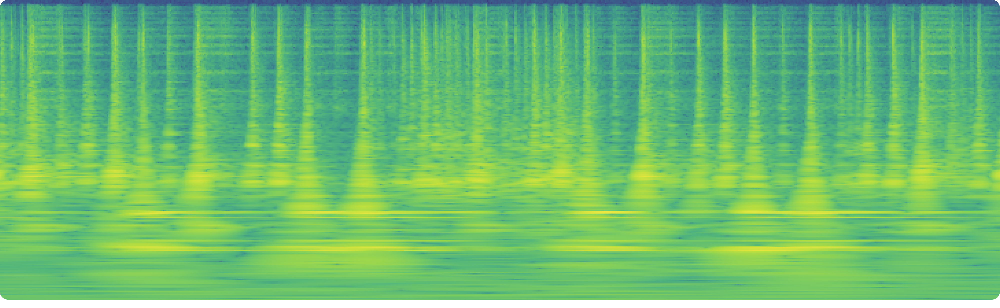

# CQT - PyTorch


An invertible and differentiable implementation of the Constant-Q Transform (CQT) using Non-stationary Gabor Transform (NSGT), in PyTorch.

```bash
pip install cqt-pytorch
```
[](https://pypi.org/project/cqt-pytorch/)


## Usage

```python
from cqt_pytorch import CQT

transform = CQT(
    num_octaves = 8,
    num_bins_per_octave = 64,
    sample_rate = 48000,
    block_length = 2 ** 18
)

# (Random) audio waveform tensor x
x = torch.randn(1, 2, 2**18) # [1, 1, 262144] = [batch_size, channels, timesteps]
z = transform.encode(x) # [1, 2, 512, 2839] = [batch_size, channels, frequencies, time]
y = transform.decode(z) # [1, 1, 262144]
```

### Example CQT Magnitude Spectrogram (z)
</img>

## TODO
* [x] Power of 2 length (with `power_of_2_length` constructor arg).
* [x] Understand why/if inverse window is necessary (it is necessary for perfect inversion).
* [ ] Allow variable audio lengths by chunking.

## Appreciation
Special thanks to [Eloi Moliner](https://github.com/eloimoliner) for taking the time to help me understand how CQT works. Check out his own implementation with interesting features at [eloimoliner/CQT_pytorch](https://github.com/eloimoliner/CQT_pytorch).

## Citations

```bibtex
@article{1210.0084,
Author = {Nicki Holighaus and Monika Dörfler and Gino Angelo Velasco and Thomas Grill},
Title = {A framework for invertible, real-time constant-Q transforms},
Year = {2012},
Eprint = {arXiv:1210.0084},
Doi = {10.1109/TASL.2012.2234114},
}
```
